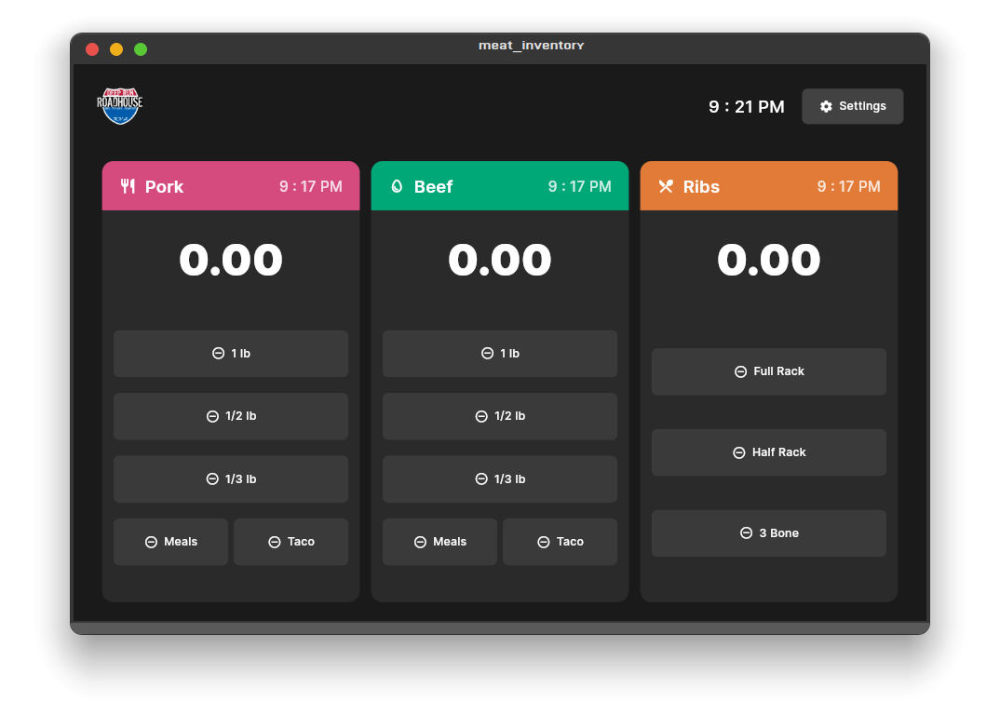
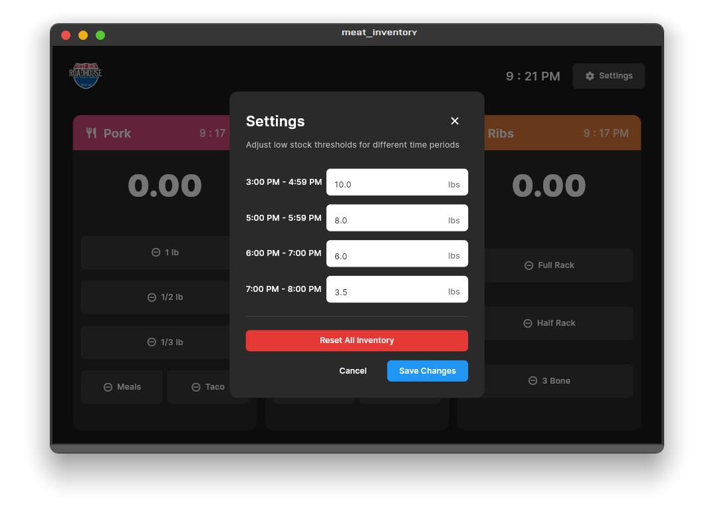

# Meat Inventory Management App

A tablet-optimized Flutter application designed for a restaurant to efficiently track and manage meat inventory in real-time. The app provides an intuitive interface for monitoring meat quantities, managing portion controls, and receiving low stock alerts based on time-specific thresholds.

## Screenshots

### Main Inventory Screen

*Real-time inventory tracking with color-coded cards and portion control buttons*

### Settings Screen

*Configurable time-based threshold settings for inventory management*

## Features

### Real-time Inventory Tracking
- Monitor three types of meat: Pork, Beef, and Ribs
- Large, easy-to-read displays of current quantities
- Color-coded cards for different meat types
- Last updated time display for each item

### Smart Portion Control
- Quick-access buttons for common portion sizes:
  - Standard weights (1 lb, 1/2 lb, 1/3 lb)
  - Meal portions (Meals, Taco)
  - Rib portions (Full Rack, Half Rack, 3 Bone)
- Double-tap prevention to avoid accidental entries
- Manual quantity adjustment option

### Intelligent Stock Alerts
- Time-based threshold monitoring
- Visual alerts (red border) when stock falls below thresholds
- Configurable thresholds for different time periods:
  - 3:00 PM - 4:59 PM
  - 5:00 PM - 5:59 PM
  - 6:00 PM - 7:00 PM
  - 7:00 PM - 8:00 PM

### Persistent Storage
- Local data storage using Hive
- Maintains inventory counts across app restarts
- Preserves threshold settings

## Technical Details

### Built With
- Flutter
- Riverpod for state management
- Hive for local storage
- ScreenUtil for responsive design

### Optimizations
- Tablet-optimized UI (11-inch screen)
- Responsive design with proper scaling
- Debounced button interactions
- 12-hour time format with AM/PM

## Getting Started

### Prerequisites
- Flutter SDK
- Dart SDK
- Android Studio or VS Code with Flutter extensions

### Installation

1. Clone the repository:
```bash
git clone [repository-url]
```

2. Navigate to the project directory:
```bash
cd meat_inventory
```

3. Install dependencies:
```bash
flutter pub get
```

4. Run the app:
```bash
flutter run
```

## Usage

1. **Main Screen**
   - View current inventory levels
   - Tap quantity buttons to reduce stock
   - Tap the main number to manually adjust quantities
   - Monitor time-based alerts

2. **Settings**
   - Access via the settings button in the top right
   - Adjust threshold values for different time periods
   - Reset inventory if needed


